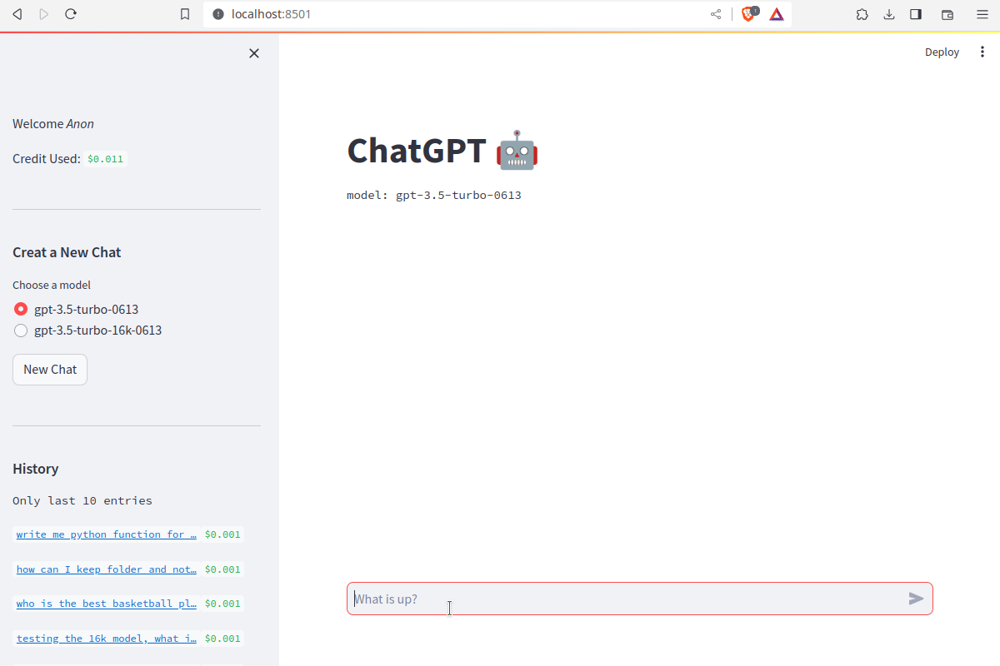

# Streamlit Chat 🤖

Streamlit chat is a chat-gpt powered chat bot build with streamlit.
With history 📚 and cost estimation for every conversation 💰!

It runs with you personal `OPENAI_API_KEY`, which has to be stored in
`$OPENAI_API_KEY` environmental variable.

## Installation and Running
You can install dependencies with poetry.

```bash
poetry shell # to create virtual environment
poetry install # install all dependencies
streamlit run app.py # run app
```

Navigate to http://localhost:8501/ to open the app.




## Further Settings

You can adjust the config in the `config.yaml` file. Where you can:
- turn on authentication module
- set the location of the database file
- and add a list of models that user can choose from

If you want to set up authentication, you have to also provide a `auth_config.yaml`
settings, where you can set up the users. You have an example in the `auth_config_example.yaml`.
Copy it to `auth_config.yaml` and create your users, follow the instructions here
https://github.com/mkhorasani/Streamlit-Authenticator. When you create new passowrds for
users you will need to hash them:
```python
import streamlit_authenticator as stauth

list_of_passwords = [
    "myverysecretpass1",
    "myverysecretpass2",
]
hashed_passwords = stauth.Hasher(list_of_passwords).generate()

print(hashed_passwords)
```


Have fun!

## TODOs
- [x] conversation caching in the database
- [x] conversation history shown in the sidebar
- [x] login
    - https://github.com/mkhorasani/Streamlit-Authenticator 
    - https://github.com/bleumink/streamlit-keycloak
- [x] add the cost estimates
- [ ] add system message input
- [ ] add detalied settings modal to do more settings than in the sidebar